# SmartHome

SmartHome is a web-based smart home management platform designed to centralize the control of connected devices, household automation, security monitoring, and user management within a single interface.

---

## About the Project

The goal of SmartHome is to provide homeowners with a unified environment for monitoring and managing various aspects of a smart home ecosystem.

The platform allows users to:

- monitor the current state of the home,
- control connected devices and appliances,
- manage automation rules and schedules,
- receive notifications about important events,
- analyze household statistics,
- manage user accounts and permissions,
- securely access the system through authentication mechanisms.

The application was designed based on user research, including interviews and surveys, which helped identify the most important user needs and expectations regarding smart home management systems.

---

## Technologies

The project was implemented using the following technologies:

- **React** – user interface development
- **TypeScript** – type-safe application logic
- **Vite** – development environment and build tool
- **Tailwind CSS** – styling and responsive layouts
- **shadcn/ui** – reusable UI components
- **React Router** – client-side routing
- **Firebase Authentication** – user registration and login
- **Google Analytics** – user activity tracking
- **Hotjar** – user behavior analysis and heatmaps

---

## Project Objectives

The main objectives of the project were:

- designing an intuitive smart home management interface,
- applying user-centered design principles,
- creating a modular and scalable front-end architecture,
- implementing secure user authentication,
- validating design decisions through analytics and user behavior tracking.

## Authentication

SmartHome provides a secure authentication system powered by Firebase Authentication. Users can create personal accounts, sign in using their email address and password, and access protected areas of the application.

The authentication flow was designed to be simple and intuitive, ensuring a smooth onboarding experience while maintaining secure access control. Registered users remain authenticated across sessions, allowing seamless access to their smart home environment.

### Registration

The registration page allows new users to create an account by providing their full name, email address, and password. Validation mechanisms ensure that all required fields are completed correctly before account creation. After successful registration, the user is redirected to the login page.

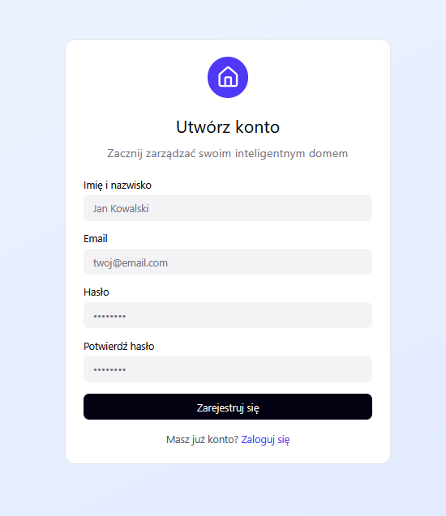

### Login

The login page enables existing users to access the system using their registered email address and password. User credentials are verified through Firebase Authentication, providing secure and reliable account management.

Protected routes ensure that only authenticated users can access the main application modules.

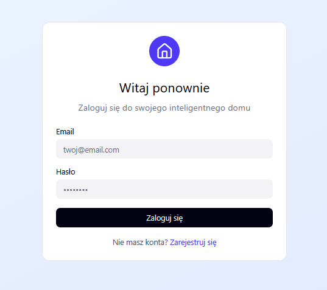

## Dashboard

The Dashboard serves as the central hub of the SmartHome platform, providing users with a quick overview of the most important information related to their smart home environment.

The page aggregates key system indicators such as current temperature, lighting status, and security monitoring. By presenting essential information in a clear and organized layout, users can quickly assess the current state of their home without navigating through multiple sections.

The dashboard also provides access to predefined automation scenarios through quick action cards. These scenarios allow users to perform common actions with a single click, such as activating a night mode, preparing the house for departure, returning home, or creating a movie-watching atmosphere.

In addition, the dashboard displays the most important connected devices, enabling users to monitor their current status and adjust selected settings directly from the main screen. This approach reduces interaction time and improves overall usability by making frequently used controls immediately accessible.

The dashboard was designed according to user-centered design principles identified during the research phase, where participants emphasized the importance of centralized information, quick access to critical functions, and immediate visibility of device status.

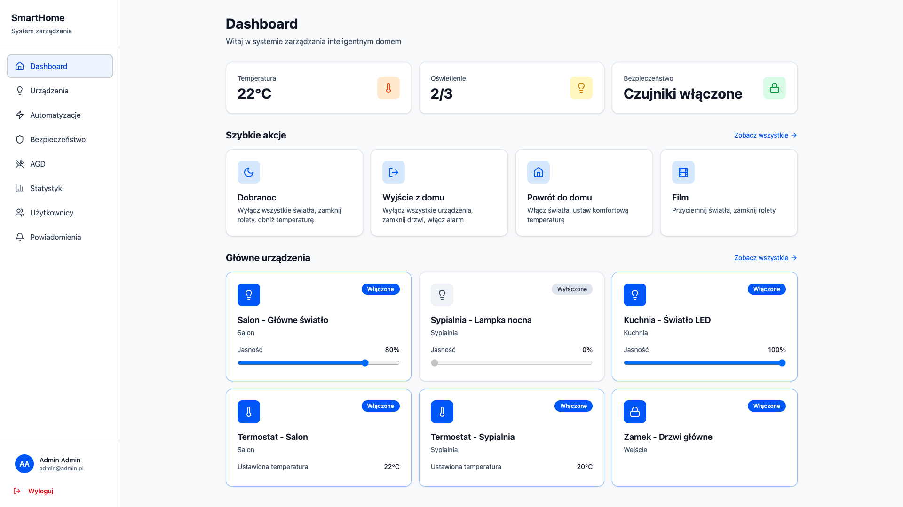

## Devices

The Devices section provides a centralized interface for managing all connected smart home devices. Users can browse available equipment, monitor its current status, and interact with individual devices directly from a single view.

To improve usability, the page includes filtering options that allow devices to be organized by room and device type. This enables users to quickly locate specific equipment, especially in larger smart home environments containing multiple connected devices.

Each device card presents essential information such as device name, location, operational status, and configurable parameters. Depending on the device type, users can adjust settings such as lighting brightness, thermostat temperature, or access control states.

The interface also supports device lifecycle management, including adding new devices to the system and removing existing ones. This functionality ensures that the platform remains flexible and adaptable to changing household configurations.

The design emphasizes visibility of system status and direct manipulation principles, allowing users to perform common management tasks without navigating away from the device overview.

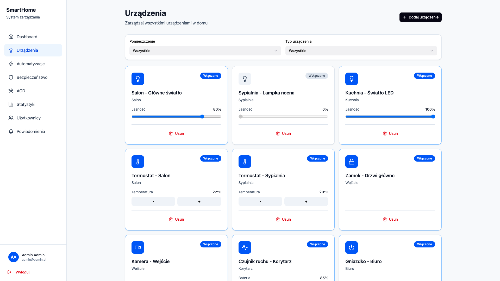

### Automations & Scenes

The Automations section enables users to simplify everyday household activities through predefined scenes and automation rules. Instead of controlling individual devices separately, users can execute multiple actions simultaneously with a single interaction.

Scenes represent common smart home scenarios that combine the behavior of several devices into a unified action. Examples include activating a night mode, preparing the home before leaving, returning home, or creating an optimized environment for watching movies. Each scene contains a predefined set of device configurations that can be triggered instantly.

By automating repetitive tasks, users can reduce manual interactions and create a more convenient and personalized smart home experience. This approach improves efficiency while supporting the core smart home principle of intelligent, context-aware behavior.

The interface presents each scene as a separate card containing a short description, information about the number of affected devices, and a dedicated action button for execution. The layout was designed to provide quick access to the most frequently used routines while maintaining clarity and ease of use.

Future extensions may include advanced rule creation based on schedules, sensor data, user presence, or environmental conditions, allowing for even greater automation capabilities.

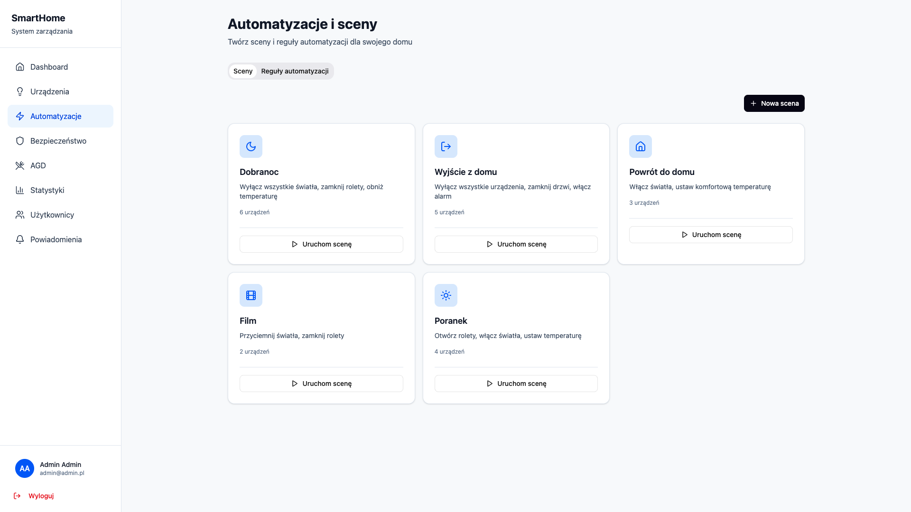

## Security Monitoring

The Security section provides centralized monitoring and management of the smart home's security infrastructure. Its primary purpose is to increase user awareness of potential threats while enabling quick responses to security-related events.

The module allows users to control and monitor key security components, including the alarm system, motion detectors, and door and window sensors. Each security element can be activated or deactivated independently, providing flexibility and adaptation to different household scenarios.

To improve situational awareness, the interface presents the current status of security devices in a clear and easily accessible format. Users can immediately determine whether the alarm system is active and how many sensors are currently operating within the monitored environment.

The page also includes an alert simulation mechanism that demonstrates how security incidents are communicated to users. This functionality was introduced to visualize the notification process and validate the effectiveness of the designed warning system.

The design focuses on visibility of system status, immediate feedback, and rapid access to critical security controls, ensuring that important information remains easily accessible at all times.

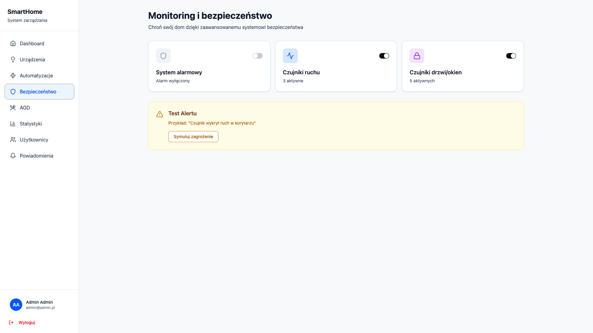

## Smart Appliances

The Appliances section extends the smart home ecosystem beyond traditional devices by providing dedicated control interfaces for advanced household appliances. The current prototype includes a robotic vacuum cleaner and a smart coffee machine, demonstrating how specialized devices can be integrated into a unified management platform.

Unlike standard smart devices, appliances often require more complex interactions and device-specific settings. For this reason, the interface was designed around dedicated control panels that expose the most relevant parameters while maintaining consistency with the overall application design.

### Robotic Vacuum Cleaner

The robotic vacuum cleaner module enables users to monitor battery status, configure cleaning modes, and remotely control cleaning operations. Users can start or stop cleaning tasks, return the device to its charging station, and manage cleaning schedules through an intuitive interface.

The design focuses on providing immediate access to the most frequently used actions while ensuring that important operational information, such as battery level and current status, remains clearly visible.

### Smart Coffee Machine

The smart coffee machine module allows users to customize beverage preparation according to personal preferences. Users can adjust drink size, coffee strength, and brewing temperature while also selecting predefined beverage types through quick-access presets.

The appliance supports scheduled beverage preparation, enabling users to automate their daily routines and have coffee prepared at predefined times. This functionality demonstrates how smart home systems can improve convenience by automating recurring household activities.

Overall, the Appliances section highlights the platform's ability to manage diverse categories of smart devices through specialized yet consistent user interfaces.

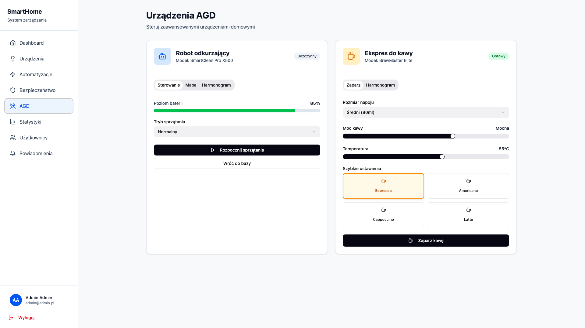

## Statistics & Energy Monitoring

The Statistics section provides users with insights into household energy consumption and system activity over time. By transforming raw usage data into clear visualizations, the platform helps users better understand how resources are being utilized and identify opportunities for optimization.

The dashboard presents key energy-related metrics, including total consumption and average daily usage. These indicators offer a quick overview of household efficiency and support informed decision-making regarding device usage and automation strategies.

To enhance data interpretation, the module includes interactive charts that visualize energy consumption trends across different time periods. Users can easily compare daily usage patterns and identify fluctuations in consumption throughout the week.

The integration of analytical features extends the platform beyond simple device control by introducing monitoring and reporting capabilities. This approach supports one of the fundamental goals of smart home systems: improving efficiency through data-driven insights.

The visual design prioritizes clarity and accessibility, ensuring that energy information can be understood quickly without requiring technical expertise.

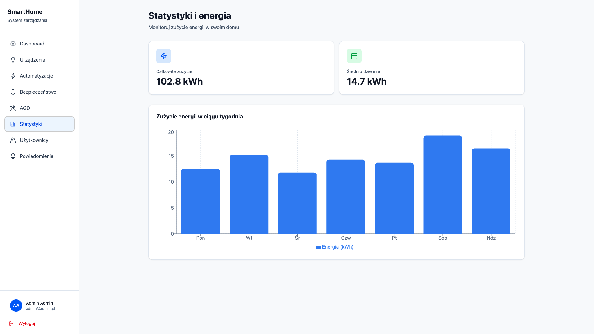

## Users & Roles

The Users & Roles section enables household access management by providing role-based control over the smart home system. This functionality ensures that different users can interact with the platform according to their responsibilities and permissions.

The module supports multiple user roles, including administrators and household members. Administrators have full access to all system features, including user management, device configuration, and security settings. Household members are granted access to everyday smart home operations while being restricted from performing administrative actions.

The interface provides a centralized overview of all registered users, displaying their contact information and assigned roles. Administrators can modify user permissions, add new household members, and remove existing accounts when necessary.

Role-based access control improves both security and usability by ensuring that users only interact with features relevant to their responsibilities. This approach reduces the risk of accidental configuration changes while maintaining a convenient user experience for all household members.

The design emphasizes clarity and transparency, allowing administrators to quickly understand the structure of user permissions and manage access rights efficiently.

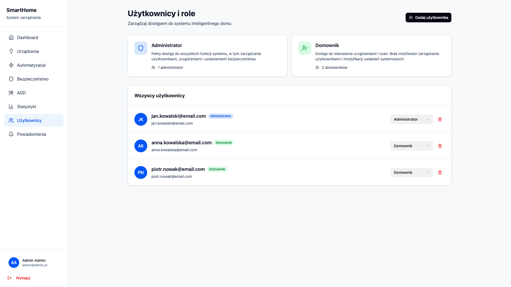

## Notifications Center

The Notifications Center serves as a centralized communication hub that informs users about important events occurring within the smart home ecosystem. By aggregating system messages, security alerts, automation updates, and device status changes in a single location, the platform helps users remain aware of their home's current state at all times.

Notifications are categorized according to their importance and purpose, allowing users to quickly distinguish between critical security events, warnings, informational messages, and successful system actions. This prioritization improves situational awareness and enables faster responses to important incidents.

The module supports common notification management actions, including marking notifications as read, deleting individual messages, and clearing the entire notification history. These features help users maintain an organized and relevant notification feed.

In addition to viewing notifications, users can customize notification preferences through dedicated settings. This includes enabling or disabling alerts related to device status changes, automation activities, security incidents, and periodic energy consumption reports.

The design emphasizes visibility, clarity, and efficient information processing, ensuring that important events are communicated effectively without overwhelming the user.

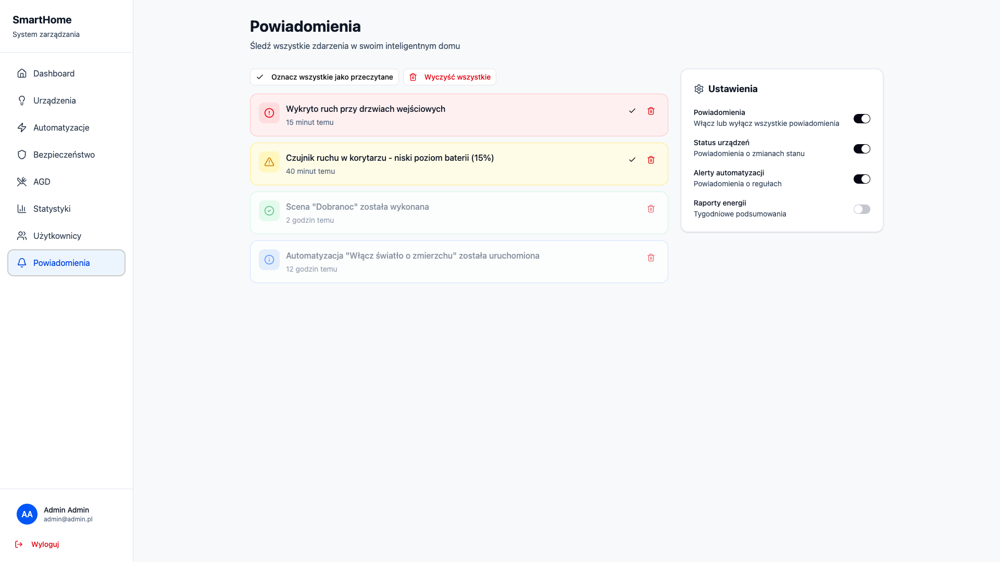

---

## Google Analytics

### Traffic Overview

### User Acquisition

### User Engagement

### Most Visited Pages

### Key Insights

---

## Hotjar Analysis

### Heatmaps

### Session Recordings

### Scroll Maps

### User Behavior Observations

### Design Improvements Based on Findings

---

## Deployment

The application is deployed on **Vercel** and available publicly at:

https://advanced-programming-techniques-mfk.vercel.app/

Production deployment screenshot:

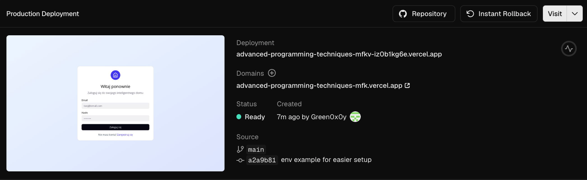
Deployment notes:

- Hosting platform: **Vercel**
- Production branch: **main**
- Build command: `npm run build`
- Output directory: `dist`
- Environment variables are configured in Vercel project settings (Firebase keys)

---

## Installation

Clone the repository and install all required dependencies:

```bash
git clone <repository-url>
cd smarthome
npm install
```

If Firebase is not installed, run:

```bash
npm install firebase
```

Start the development server:

```bash
npm run dev
```

The application will be available at:

```text
http://localhost:5173
```

---

## Firebase Configuration

The application uses Firebase Authentication for user registration and login.

### 1. Create a Firebase Project

1. Go to the Firebase Console:
   https://console.firebase.google.com

2. Create a new project.

3. Register a Web Application.

4. Enable Authentication:
   - Open **Authentication**
   - Select **Sign-in method**
   - Enable **Email/Password**

### 2. Create Environment Variables

Create a `.env` file in the project root directory and add the following variables:

```env
VITE_FIREBASE_API_KEY=YOUR_API_KEY
VITE_FIREBASE_AUTH_DOMAIN=YOUR_AUTH_DOMAIN
VITE_FIREBASE_PROJECT_ID=YOUR_PROJECT_ID
VITE_FIREBASE_STORAGE_BUCKET=YOUR_STORAGE_BUCKET
VITE_FIREBASE_MESSAGING_SENDER_ID=YOUR_SENDER_ID
VITE_FIREBASE_APP_ID=YOUR_APP_ID
VITE_FIREBASE_MEASUREMENT_ID=YOUR_MEASUREMENT_ID
```

### 3. Obtain Firebase Credentials

Open:

```text
Firebase Console ->  Project Settings -> General
```

and copy the values from the Firebase SDK configuration snippet into the `.env` file.

### 4. Restart the Development Server

After creating or modifying the `.env` file, restart the application:

```bash
npm run dev
```
