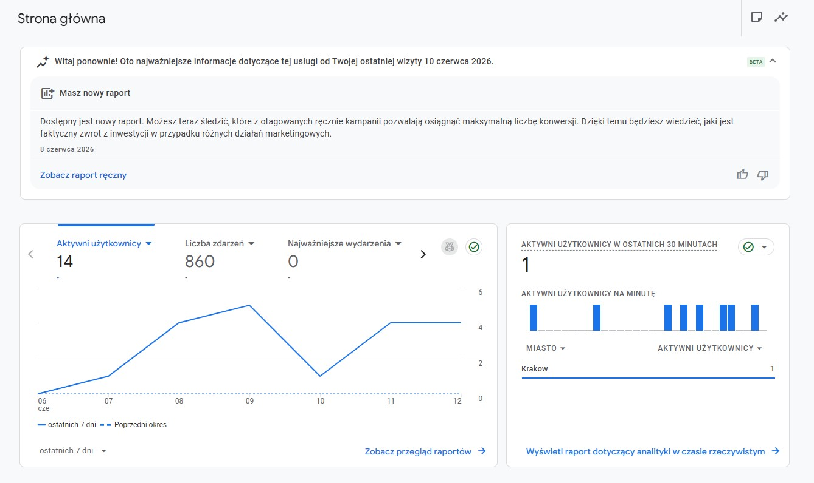
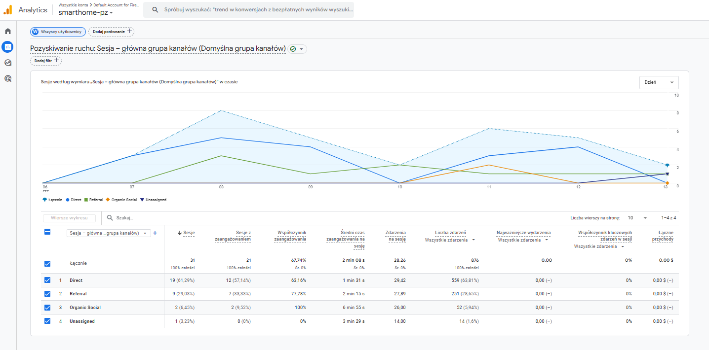
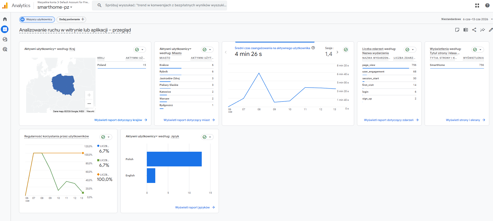
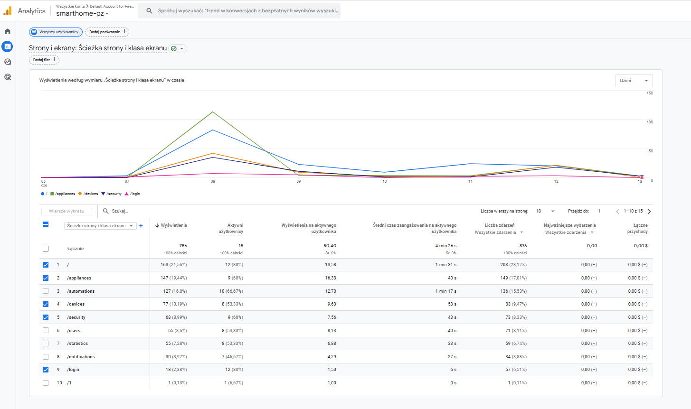
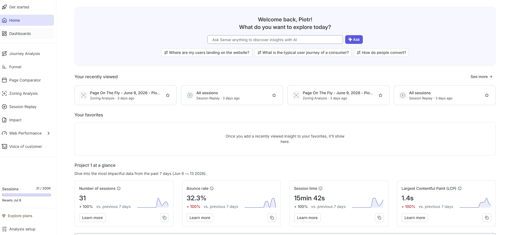
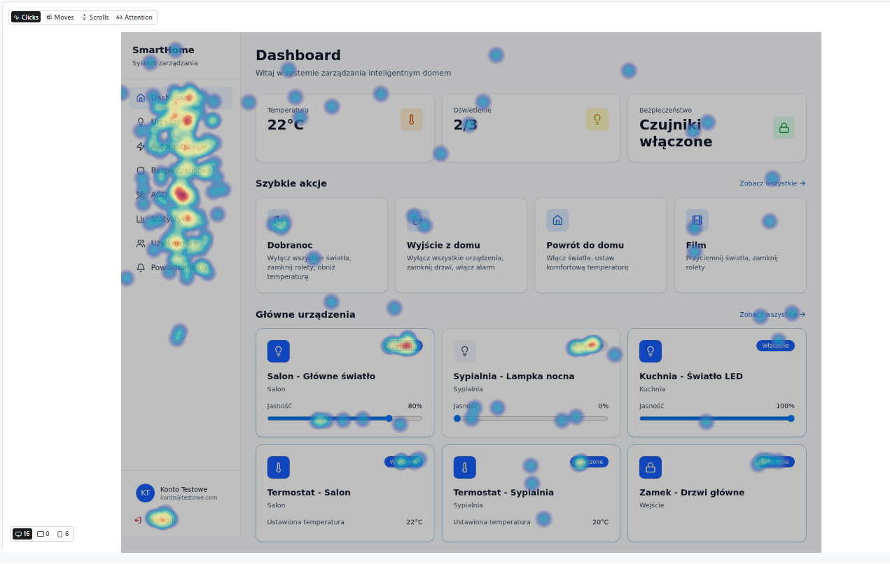
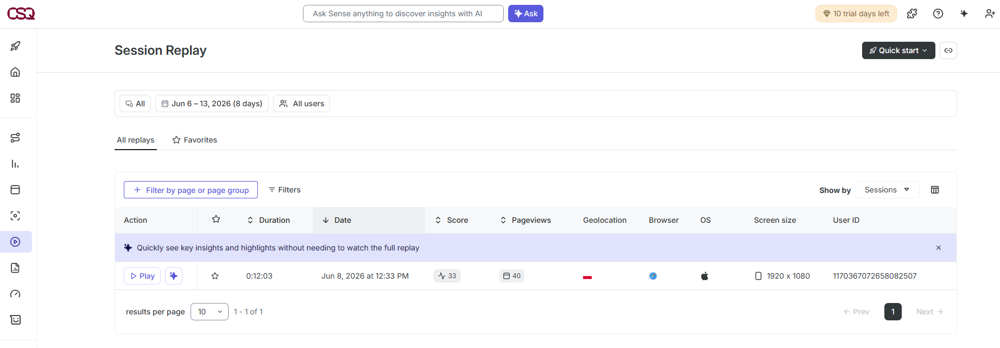
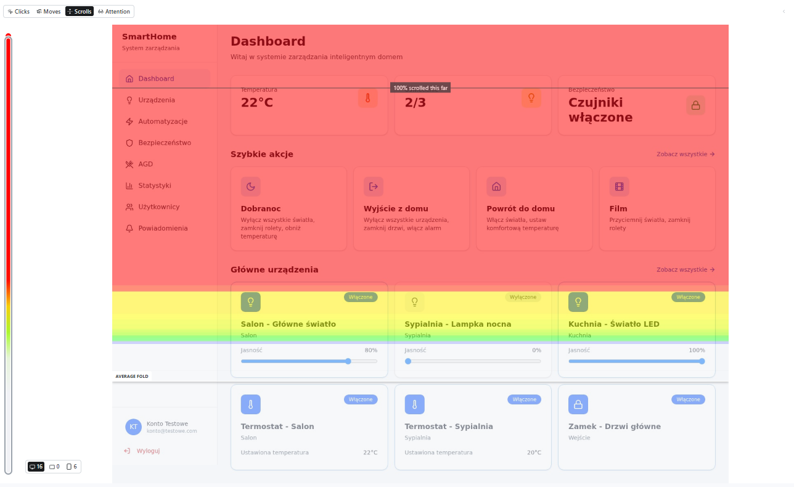

# SmartHome 

SmartHome to internetowa platforma do zarządzania inteligentnym domem, zaprojektowana w celu scentralizowania kontroli nad połączonymi urządzeniami, automatyzacją domową, monitoringiem bezpieczeństwa oraz zarządzaniem użytkownikami w ramach jednego interfejsu.

---

## O projekcie

Celem projektu SmartHome jest zapewnienie właścicielom domów jednolitego środowiska do monitorowania i zarządzania różnymi aspektami ekosystemu inteligentnego domu.

Platforma umożliwia użytkownikom:

- monitorowanie aktualnego stanu domu,
- sterowanie podłączonymi urządzeniami i sprzętami,
- zarządzanie regułami automatyzacji i harmonogramami,
- otrzymywanie powiadomień o ważnych zdarzeniach,
- analizowanie statystyk gospodarstwa domowego,
- zarządzanie kontami użytkowników i uprawnieniami,
- bezpieczny dostęp do systemu za pomocą mechanizmów uwierzytelniania.

Aplikacja została zaprojektowana na podstawie badań użytkowników, obejmujących wywiady i ankiety, które pomogły zidentyfikować najważniejsze potrzeby i oczekiwania dotyczące systemów zarządzania inteligentnym domem.

---

## Technologie

Projekt został zrealizowany z wykorzystaniem następujących technologii:

- **React** – tworzenie interfejsu użytkownika,
- **TypeScript** – logika aplikacji z bezpiecznym systemem typów,
- **Vite** – środowisko programistyczne i narzędzie do budowania aplikacji,
- **Tailwind CSS** – stylizacja i responsywne układy,
- **shadcn/ui** – wielokrotnego użytku komponenty interfejsu,
- **React Router** – routing po stronie klienta,
- **Firebase Authentication** – rejestracja i logowanie użytkowników,
- **Google Analytics** – analiza aktywności użytkowników,
- **Hotjar** – analiza zachowań użytkowników i mapy cieplne.

---

## Cele projektu

Główne cele projektu obejmowały:

- zaprojektowanie intuicyjnego interfejsu do zarządzania inteligentnym domem,
- zastosowanie zasad projektowania zorientowanego na użytkownika (User-Centered Design),
- stworzenie modułowej i skalowalnej architektury front-endowej,
- implementację bezpiecznego systemu uwierzytelniania użytkowników,
- weryfikację decyzji projektowych za pomocą analityki oraz monitorowania zachowań użytkowników.

## Uwierzytelnianie

SmartHome zapewnia bezpieczny system uwierzytelniania oparty na Firebase Authentication. Użytkownicy mogą tworzyć własne konta, logować się za pomocą adresu e-mail i hasła oraz uzyskiwać dostęp do chronionych obszarów aplikacji.

Proces uwierzytelniania został zaprojektowany tak, aby był prosty i intuicyjny, zapewniając łatwe rozpoczęcie korzystania z aplikacji przy jednoczesnym zachowaniu bezpieczeństwa dostępu. Zalogowani użytkownicy pozostają uwierzytelnieni pomiędzy sesjami, co umożliwia wygodny i nieprzerwany dostęp do środowiska inteligentnego domu.

### Rejestracja

Strona rejestracji umożliwia nowym użytkownikom utworzenie konta poprzez podanie imienia i nazwiska, adresu e-mail oraz hasła. Mechanizmy walidacji sprawdzają poprawność wszystkich wymaganych pól przed utworzeniem konta. Po pomyślnej rejestracji użytkownik zostaje przekierowany na stronę logowania.


### Logowanie

Strona logowania umożliwia istniejącym użytkownikom dostęp do systemu przy użyciu zarejestrowanego adresu e-mail oraz hasła. Dane logowania są weryfikowane za pomocą Firebase Authentication, co zapewnia bezpieczne i niezawodne zarządzanie kontami użytkowników.

Chronione ścieżki aplikacji gwarantują, że jedynie uwierzytelnieni użytkownicy mogą uzyskać dostęp do głównych modułów systemu.


## Panel główny (Dashboard)

Panel główny stanowi centralne miejsce platformy SmartHome, zapewniając użytkownikom szybki dostęp do najważniejszych informacji związanych z ich środowiskiem inteligentnego domu.

Strona agreguje kluczowe wskaźniki systemowe, takie jak aktualna temperatura, stan oświetlenia czy monitoring bezpieczeństwa. Dzięki przejrzystemu i uporządkowanemu układowi użytkownicy mogą szybko ocenić aktualny stan domu bez konieczności przechodzenia między wieloma sekcjami aplikacji.

Panel zapewnia również dostęp do predefiniowanych scenariuszy automatyzacji za pomocą kart szybkich akcji. Scenariusze te umożliwiają wykonanie popularnych działań jednym kliknięciem, takich jak aktywacja trybu nocnego, przygotowanie domu do wyjścia, powrót do domu czy stworzenie atmosfery do oglądania filmu.

Dodatkowo dashboard prezentuje najważniejsze podłączone urządzenia, umożliwiając monitorowanie ich stanu oraz zmianę wybranych ustawień bezpośrednio z poziomu ekranu głównego. Takie podejście skraca czas interakcji i zwiększa użyteczność systemu poprzez udostępnienie najczęściej wykorzystywanych funkcji w jednym miejscu.

Dashboard został zaprojektowany zgodnie z zasadami projektowania zorientowanego na użytkownika, zidentyfikowanymi podczas badań, w których uczestnicy podkreślali znaczenie centralizacji informacji, szybkiego dostępu do kluczowych funkcji oraz natychmiastowej widoczności stanu urządzeń.


## Urządzenia

Sekcja Urządzenia zapewnia scentralizowany interfejs do zarządzania wszystkimi podłączonymi urządzeniami inteligentnego domu. Użytkownicy mogą przeglądać dostępny sprzęt, monitorować jego aktualny stan oraz bezpośrednio sterować poszczególnymi urządzeniami z jednego miejsca.

Aby zwiększyć wygodę użytkowania, strona oferuje opcje filtrowania urządzeń według pomieszczeń oraz kategorii sprzętu. Dzięki temu użytkownicy mogą szybko odnaleźć konkretne urządzenie, szczególnie w większych środowiskach inteligentnego domu zawierających wiele połączonych elementów.

Każda karta urządzenia prezentuje najważniejsze informacje, takie jak nazwa urządzenia, lokalizacja, status działania oraz konfigurowalne parametry. W zależności od rodzaju urządzenia użytkownicy mogą modyfikować ustawienia, takie jak jasność oświetlenia, temperatura termostatu czy stan kontroli dostępu.

Interfejs wspiera również zarządzanie cyklem życia urządzeń, w tym dodawanie nowych elementów do systemu oraz usuwanie istniejących. Funkcjonalność ta zapewnia elastyczność i możliwość dostosowania platformy do zmieniających się potrzeb gospodarstwa domowego.

Projekt został oparty na zasadach widoczności stanu systemu oraz bezpośredniej manipulacji, umożliwiając wykonywanie najczęstszych działań bez konieczności opuszczania widoku urządzeń.


## Automatyzacje i Sceny

Sekcja Automatyzacje umożliwia użytkownikom uproszczenie codziennych czynności domowych poprzez wykorzystanie gotowych scen oraz reguł automatyzacji. Zamiast sterować każdym urządzeniem osobno, użytkownicy mogą wykonywać wiele działań jednocześnie za pomocą pojedynczej interakcji.

Sceny reprezentują typowe sytuacje występujące w inteligentnym domu i łączą działanie wielu urządzeń w jedną akcję. Przykładowe scenariusze obejmują aktywację trybu nocnego, przygotowanie domu do wyjścia, powrót do domu czy stworzenie odpowiednich warunków do oglądania filmów.

Dzięki automatyzacji powtarzalnych czynności użytkownicy mogą ograniczyć liczbę ręcznych operacji i stworzyć bardziej komfortowe oraz spersonalizowane środowisko domowe. Takie podejście zwiększa wygodę użytkowania i wspiera jedną z podstawowych idei inteligentnych domów – inteligentne reagowanie na kontekst i potrzeby mieszkańców.

Interfejs prezentuje każdą scenę w formie osobnej karty zawierającej krótki opis, informację o liczbie urządzeń objętych scenariuszem oraz przycisk umożliwiający jego uruchomienie.

W przyszłości system może zostać rozszerzony o zaawansowane reguły automatyzacji oparte na harmonogramach, danych z czujników, obecności użytkowników czy warunkach środowiskowych.


## Monitoring i Bezpieczeństwo

Sekcja Bezpieczeństwo zapewnia centralne miejsce do monitorowania oraz zarządzania infrastrukturą bezpieczeństwa inteligentnego domu. Jej głównym celem jest zwiększenie świadomości użytkowników dotyczącej potencjalnych zagrożeń oraz umożliwienie szybkiej reakcji na zdarzenia związane z bezpieczeństwem.

Moduł umożliwia kontrolę i monitorowanie kluczowych elementów zabezpieczeń, takich jak system alarmowy, czujniki ruchu oraz sensory drzwi i okien. Każdy z elementów może być aktywowany lub dezaktywowany niezależnie od pozostałych.

Aby zwiększyć świadomość sytuacyjną, interfejs prezentuje aktualny stan wszystkich urządzeń zabezpieczających w przejrzystej i łatwo dostępnej formie. Użytkownicy mogą natychmiast sprawdzić, czy alarm jest aktywny oraz ile czujników działa w monitorowanym środowisku.

Strona zawiera również mechanizm symulacji alertów, który demonstruje sposób komunikowania incydentów bezpieczeństwa użytkownikowi. Funkcja ta została dodana w celu wizualizacji procesu powiadamiania i weryfikacji skuteczności zaprojektowanego systemu ostrzegania.

Projekt koncentruje się na zapewnieniu widoczności stanu systemu, natychmiastowej informacji zwrotnej oraz szybkiego dostępu do kluczowych funkcji związanych z bezpieczeństwem.


## Inteligentne Urządzenia AGD

Sekcja Urządzenia AGD rozszerza możliwości inteligentnego domu poza standardowe urządzenia, oferując dedykowane interfejsy sterowania dla bardziej zaawansowanego sprzętu gospodarstwa domowego. Obecny prototyp obejmuje robota sprzątającego oraz inteligentny ekspres do kawy.

W przeciwieństwie do klasycznych urządzeń smart, sprzęty AGD często wymagają bardziej złożonych interakcji oraz specjalistycznych ustawień. Z tego względu interfejs został zaprojektowany w oparciu o dedykowane panele sterowania zachowujące jednocześnie spójność z pozostałą częścią aplikacji.

### Robot Sprzątający

Moduł robota sprzątającego umożliwia monitorowanie poziomu baterii, konfigurację trybów sprzątania oraz zdalne sterowanie pracą urządzenia. Użytkownik może uruchamiać i zatrzymywać proces sprzątania, kierować urządzenie do stacji dokującej oraz zarządzać harmonogramami pracy.

Projekt skupia się na zapewnieniu szybkiego dostępu do najczęściej wykorzystywanych funkcji przy jednoczesnym zachowaniu widoczności najważniejszych informacji operacyjnych.

### Inteligentny Ekspres do Kawy

Moduł inteligentnego ekspresu umożliwia personalizację procesu przygotowywania napojów zgodnie z preferencjami użytkownika. Możliwe jest dostosowanie wielkości napoju, mocy kawy oraz temperatury parzenia, a także wybór gotowych presetów.

Urządzenie wspiera również harmonogramowanie przygotowania napojów, pozwalając użytkownikom automatyzować codzienne rutyny i przygotowywać kawę o wyznaczonych porach.

Sekcja ta pokazuje możliwości platformy w zakresie obsługi różnorodnych kategorii urządzeń za pomocą wyspecjalizowanych, lecz spójnych interfejsów.


## Statystyki i Monitoring Energii

Sekcja Statystyki dostarcza użytkownikom informacji dotyczących zużycia energii oraz aktywności systemu w czasie. Dzięki przekształceniu surowych danych w przejrzyste wizualizacje platforma pomaga lepiej zrozumieć sposób wykorzystania zasobów i identyfikować możliwości optymalizacji.

Panel prezentuje najważniejsze wskaźniki energetyczne, takie jak całkowite zużycie energii oraz średnie dzienne zużycie. Dane te umożliwiają szybką ocenę efektywności gospodarstwa domowego i wspierają podejmowanie świadomych decyzji dotyczących wykorzystania urządzeń i automatyzacji.

Moduł zawiera interaktywne wykresy prezentujące trendy zużycia energii w różnych okresach czasu. Użytkownicy mogą analizować wzorce wykorzystania energii i obserwować zmiany w kolejnych dniach.

Włączenie funkcji analitycznych rozszerza możliwości platformy poza samo sterowanie urządzeniami, dostarczając narzędzi monitorujących i raportujących.


## Użytkownicy i Role

Sekcja Użytkownicy i Role umożliwia zarządzanie dostępem do systemu poprzez zastosowanie kontroli uprawnień opartej na rolach.

Moduł wspiera wiele typów użytkowników, w tym administratorów oraz członków gospodarstwa domowego. Administratorzy posiadają pełny dostęp do wszystkich funkcji systemu, natomiast pozostali użytkownicy mają dostęp jedynie do funkcji związanych z codziennym korzystaniem z inteligentnego domu.

Interfejs prezentuje listę wszystkich zarejestrowanych użytkowników wraz z ich danymi kontaktowymi i przypisanymi rolami. Administratorzy mogą zarządzać uprawnieniami, dodawać nowych użytkowników oraz usuwać istniejące konta.

Kontrola dostępu oparta na rolach zwiększa bezpieczeństwo systemu i ogranicza ryzyko przypadkowych zmian konfiguracji.


## Powiadomienia

Centrum Powiadomień stanowi centralny punkt komunikacji informujący użytkowników o istotnych zdarzeniach zachodzących w ekosystemie inteligentnego domu.

Powiadomienia obejmują komunikaty systemowe, alerty bezpieczeństwa, informacje o automatyzacjach oraz zmiany statusu urządzeń. Wszystkie wiadomości są grupowane według poziomu ważności, co pozwala użytkownikom szybko identyfikować krytyczne zdarzenia.

Moduł umożliwia oznaczanie powiadomień jako przeczytanych, usuwanie pojedynczych komunikatów oraz czyszczenie całej historii powiadomień.

Użytkownicy mogą również dostosowywać preferencje dotyczące powiadomień, określając, które zdarzenia powinny generować alerty.

Projekt skupia się na przejrzystości, widoczności oraz efektywnym przekazywaniu informacji bez przeciążania użytkownika nadmiarem komunikatów.


---

## Google Analytics

Google Analytics zostało zintegrowane z aplikacją w celu śledzenia aktywności użytkowników w głównych widokach aplikacji. Dane przedstawione poniżej zostały zebrane podczas krótkiego okresu testowego (6–13 czerwca 2026) z udziałem niewielkiej grupy użytkowników testowych. Wyniki potwierdzają poprawne działanie integracji i umożliwiają podstawową analizę zachowania użytkowników w aplikacji.

### Przegląd ruchu

Raport przeglądowy potwierdził, że Google Analytics aktywnie zbiera dane z wdrożonej aplikacji. W panelu widoczni byli aktywni użytkownicy, liczba wyświetleń stron oraz zdarzenia rejestrowane w czasie rzeczywistym.



### Pozyskiwanie użytkowników

Ruch do aplikacji pochodził głównie z bezpośrednich źródeł, co jest typowe dla środowiska testowego, w którym użytkownicy wchodzą na stronę za pomocą udostępnionego linku.



### Zaangażowanie użytkowników

Raport zaangażowania wykazał wyświetlenia stron oraz interakcje użytkowników w całej aplikacji. Użytkownicy przechodzili między wieloma widokami podczas swoich sesji, co potwierdziło poprawne śledzenie routingu SPA.



### Najczęściej odwiedzane strony

Raport stron potwierdził, że wszystkie główne moduły aplikacji były odwiedzane podczas testów. Do najczęściej odwiedzanych ścieżek należały: `/`, `/appliances`, `/automations`, `/devices`, `/security`, `/users`, `/statistics`, `/notifications` oraz `/login`.



### Kluczowe wnioski

- Google Analytics zostało poprawnie zintegrowane i zbierało dane z wdrożonej aplikacji.
- Routing SPA był prawidłowo odzwierciedlony w raportach stron.
- Wszystkie główne moduły aplikacji były odwiedzane w trakcie okresu testowego.
- Ruch pochodził głównie z bezpośrednich źródeł, co jest typowe dla środowiska testowego.
- Dane mają charakter testowy i służą potwierdzeniu integracji oraz podstawowej analizie zachowań użytkowników.

---

## Analiza Hotjar

Hotjar (za pośrednictwem Contentsquare) został zintegrowany z aplikacją przy użyciu skryptu śledzącego dodanego do pliku `index.html`. Narzędzie zbierało dane sesji podczas okresu testowego. Poniższy przegląd potwierdza, że integracja była aktywna i sesje zostały zarejestrowane.



### Mapy cieplne

Mapa cieplna kliknięć została wygenerowana dla widoku Dashboard, który stanowi główny ekran aplikacji. Mapa wskazuje obszary aktywności na głównym ekranie, w tym menu nawigacyjne oraz karty urządzeń.



### Nagrania sesji użytkowników

Nagrania sesji były dostępne dla ograniczonej liczby sesji. Ze względu na ustawienia prywatności treść tekstowa w nagraniach była maskowana. Nagrania potwierdziły, że użytkownicy poruszali się między głównymi modułami aplikacji.



### Mapy przewijania

Mapa przewijania została wygenerowana dla widoku Dashboard i pokazuje, jak daleko użytkownicy przewijali główny ekran aplikacji podczas swoich sesji.



### Obserwacje zachowań użytkowników

- Użytkownicy odwiedzali różne sekcje aplikacji podczas swoich sesji, w tym Urządzenia, AGD, Automatyzacje, Bezpieczeństwo i Statystyki.
- Dashboard pokazał widoczną aktywność wokół nawigacji i szybkich akcji, natomiast widok AGD należał do najczęściej odwiedzanych stron.
- Menu boczne było głównym sposobem nawigacji między sekcjami aplikacji.
- Ze względu na ograniczoną liczbę sesji testowych obserwacje mają charakter orientacyjny.

### Usprawnienia projektu na podstawie uzyskanych wyników

- Najczęściej odwiedzane sekcje (Urządzenia, AGD) mogłyby zostać lepiej wyeksponowane na ekranie głównym.
- Aktywne stany przełączników i przycisków akcji zostały ulepszone poprzez dodanie efektów hover na podstawie wniosków z analizy.
- Dalsze testy z większą grupą użytkowników dostarczyłyby bardziej miarodajnych danych z heatmap i nagrań sesji.
- Przy większej liczbie sesji analiza głębokości przewijania mogłaby dostarczyć dodatkowych wskazówek projektowych.

---

## Wdrożenie

Aplikacja została wdrożona na platformie **Vercel** i jest publicznie dostępna pod adresem:

https://advanced-programming-techniques-mfk.vercel.app/

Zrzut ekranu środowiska produkcyjnego:


Informacje dotyczące wdrożenia:

- Platforma hostingowa: **Vercel**
- Gałąź produkcyjna: **main**
- Komenda budowania aplikacji: `npm run build`
- Katalog wyjściowy: `dist`
- Zmienne środowiskowe zostały skonfigurowane w ustawieniach projektu Vercel (klucze Firebase)

---

## Instalacja

Sklonuj repozytorium i zainstaluj wszystkie wymagane zależności:

```bash
git clone <adres-repozytorium>
cd smarthome
npm install
```

Jeżeli Firebase nie jest zainstalowany, uruchom:

```bash
npm install firebase
```

Uruchom serwer deweloperski:

```bash
npm run dev
```

Aplikacja będzie dostępna pod adresem:

```text
http://localhost:5173
```

---

## Konfiguracja Firebase

Aplikacja wykorzystuje Firebase Authentication do rejestracji oraz logowania użytkowników.

### 1. Utworzenie projektu Firebase

1. Przejdź do konsoli Firebase:
   https://console.firebase.google.com

2. Utwórz nowy projekt.

3. Zarejestruj aplikację internetową (Web Application).

4. Włącz moduł Authentication:
   - Otwórz sekcję **Authentication**
   - Przejdź do **Sign-in method**
   - Włącz metodę **Email/Password**

### 2. Utworzenie zmiennych środowiskowych

Utwórz plik `.env` w głównym katalogu projektu i dodaj następujące zmienne:

```env
VITE_FIREBASE_API_KEY=YOUR_API_KEY
VITE_FIREBASE_AUTH_DOMAIN=YOUR_AUTH_DOMAIN
VITE_FIREBASE_PROJECT_ID=YOUR_PROJECT_ID
VITE_FIREBASE_STORAGE_BUCKET=YOUR_STORAGE_BUCKET
VITE_FIREBASE_MESSAGING_SENDER_ID=YOUR_SENDER_ID
VITE_FIREBASE_APP_ID=YOUR_APP_ID
VITE_FIREBASE_MEASUREMENT_ID=YOUR_MEASUREMENT_ID
```

### 3. Pobranie danych konfiguracyjnych Firebase

Przejdź do:

```text
Firebase Console -> Project Settings -> General
```

Następnie skopiuj wartości z konfiguracji Firebase SDK i wklej je do pliku `.env`.

### 4. Ponowne uruchomienie aplikacji

Po utworzeniu lub modyfikacji pliku `.env` uruchom aplikację ponownie:

```bash
npm run dev
```

---

## Role użytkowników

Aplikacja obsługuje dwie role użytkowników: **admin** oraz **member**. Każdy nowo zarejestrowany użytkownik automatycznie otrzymuje rolę `member`.

### Nadawanie roli administratora w Firebase Console

Rola `admin` może zostać przypisana użytkownikowi za pomocą konsoli Firebase.

### Uprawnienia administratora

| Funkcja                                 | admin | member |
| --------------------------------------- | ----- | ------ |
| Przeglądanie listy użytkowników         | ✅    | ✅     |
| Dodawanie nowych użytkowników           | ✅    | ❌     |
| Zmiana ról użytkowników                 | ✅    | ❌     |
| Usuwanie użytkowników                   | ✅    | ❌     |
| Dostęp do pozostałych funkcji aplikacji | ✅    | ✅     |
